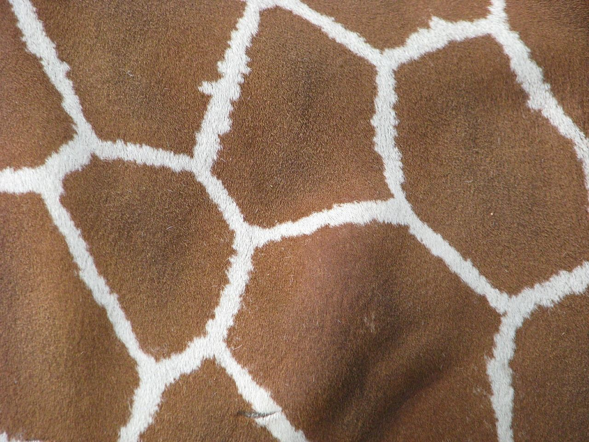
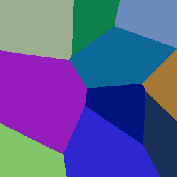

# voronoi

Voronoi pattern generator.

## Voronoi?

A [voronoi diagram](https://en.wikipedia.org/wiki/Voronoi_diagram) is a way to divide a plane into sections. Seeds are randomly placed within the plane and each pixel is colored based on the closest seed.

This pattern commonly occurs in nature, for example, giraffe fur.





## Usage

```bash
$ ./voronoi --help
Usage: target\debug\voronoi.exe [Options] [filename]
Options:
        --size | -s <x,y>       Image output size (default 256x256
        --count | -c N          Seed count (default 10)
        filename                Output path (default voronoi.png)
Example: ./voronoi -s 256,256 -c 20 out.png      Outputs a 256x256 image as out.png with 20 seeds.
```